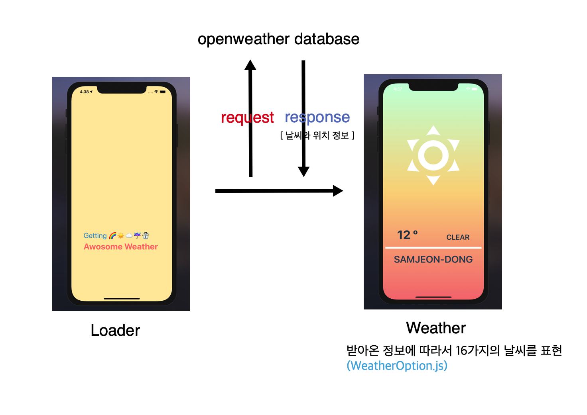

# React Native 101

> Learn react native making simple apps 🥳

## WeatherApp

> `weather-app-2021` in folder : ver.2021/2022 use rn-cli

> `weather-app` in folder : ver.2020 → use expo

> Ref : [NomadCoders ReactNative 101](https://nomadcoders.co/react-native-for-beginners)

## Expo Tutorials

> [Reference](https://docs.expo.dev/tutorial/introduction/)

진짜 오랜만에(2023.08) RN을 하는 부분이라서, 우선은 튜토리얼부터 진행해보았다.(따라하기 or 문서읽기) 원래는 RN CLI로 해야하는데, 당장 나에게 들어온 미션은 expo를 이용하는 것이기에... Start 🚀

## TodoApp

> called `WorkHardTravelHardApp` with [NomadCoders ReactNative 101](https://nomadcoders.co/react-native-for-beginners)

  
Features

- [x] 카테고리별 할 일(상단 탭) 리스트업
- [x] 할 일 생성/추가
- [x] 할 일 수정 : 내용 및 상태 변경
- [x] 할 일 제거
- [x] AsyncStorage에 할 일/탭 정보 저장

